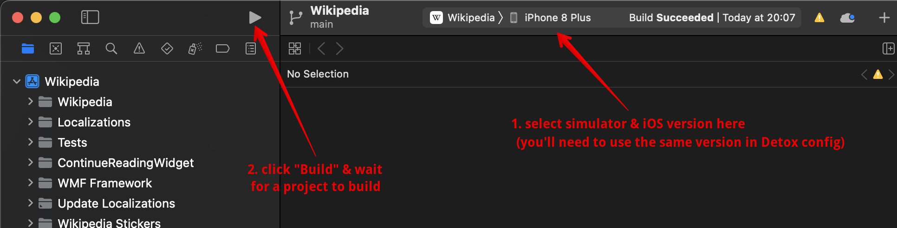

- [Setup](#setup)
  - [macOS + iOS](#macos--ios)
- [Useful links](#useful-links)

# Setup
## macOS + iOS
1. Clone this repo
2. Clone or put the app source code into your repo, for example like this `git clone --depth 1 https://github.com/wikimedia/wikipedia-ios.git sut`, where `sut` is a folder (system under test), you may name it whatever you like
3. Install Xcode
4. Install Homebrew
5. Install nodejs
6. Run the following commands from the root folder of the repo
  - `npm i`
  - `npm install detox-cli --global`
  - `brew tap wix/brew`
  - `brew install applesimutils`
7. In `.detoxrc.js`:
  - change `binaryPath` to the path of your app, for example `binaryPath: 'sut/Build/Products/Debug-iphonesimulator/Wikipedia.app'`
  - change `device` & `os` to the parameters you want to use, for example `device: { type: 'iPhone 8 Plus', os: 'iOS 16.2' }`
8. In Xcode:
  - go to `Xcode > Settings > Locations > Advanced`, then select `Custom > Relative to workspace > Done` 
  - in `Xcode > Settings > Locations` make sure the `Command Line Tools` is selected 
  - on Xcode welcome screen select `Open a project or file` to search & open project for the first time, or select the project from top right corner if you're using it subsequently 
  - select simulator device & iOS (must be the same as in `.detoxrc.js`) and click `Build` button to build a project 
9. Run `npm run detox_ios` to run Detox tests

# Useful links
- [Jest config documentation](https://jestjs.io/docs/configuration)
- [Detox documentation](https://wix.github.io/Detox/docs/config/overview/)